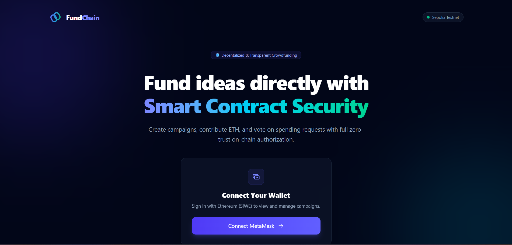
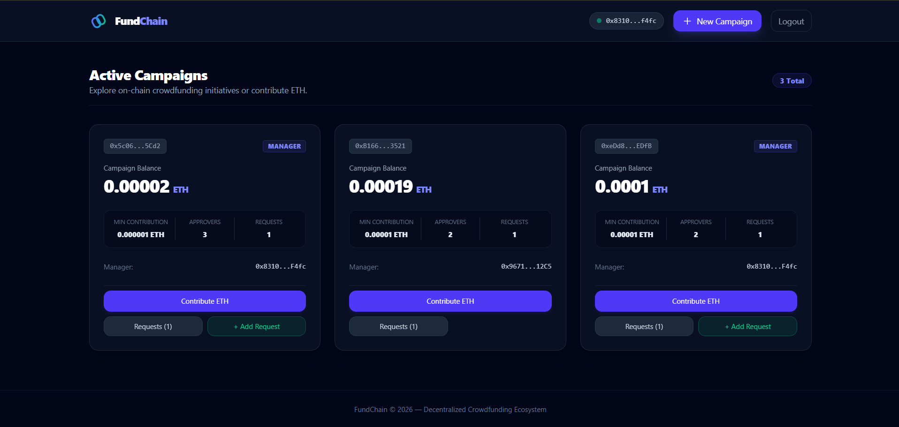

# ⛓️ FundChain

### Decentralized Fundraising & Transparent Fund Management

FundChain is a blockchain-based platform designed to make fundraising more **transparent, secure, and verifiable** by leveraging smart contracts and decentralized transactions.

The project combines a modern web application with blockchain infrastructure to reduce dependency on centralized fund management and provide an auditable record of transactions.

## 🚀 Key Features

* **Blockchain-based Fund Management** — Contributions and fund-related operations are recorded on-chain.
* **Smart Contract Automation** — Predefined contract logic handles critical fundraising operations without relying entirely on centralized intermediaries.
* **Transparent Transactions** — Blockchain records provide verifiable transaction history.
* **Secure Wallet Integration** — Enables users to interact with blockchain functionality through their wallets.
* **Campaign Management** — Users can create, manage, and contribute to fundraising campaigns.
* **Transaction Verification** — Blockchain transaction status can be independently verified.
* **Responsive Web Interface** — Modern UI designed for seamless interaction across devices.

## 🏗️ Architecture

```text
┌──────────────────────┐
│      React UI        │
└──────────┬───────────┘
           │
           ▼
┌──────────────────────┐
│    Backend / API     │
│   Node.js + Express  │
└───────┬────────┬─────┘
        │        │
        ▼        ▼
┌────────────┐ ┌──────────────────┐
│  Database  │ │  Smart Contracts │
│  MongoDB   │ │     Solidity     │
└────────────┘ └────────┬─────────┘
                        │
                        ▼
                ┌───────────────┐
                │  Blockchain   │
                └───────────────┘
```

## 🛠️ Tech Stack

**Frontend**

* React.js
* JavaScript
* Tailwind CSS
* Axios

**Backend**

* Node.js
* Express.js
* MongoDB

**Blockchain**

* Solidity
* EVM-compatible blockchain
* Smart Contracts
* Ethers.js 


# Screenshots

## Home Page



## Dashboard Page



---


## 🔐 Security & Blockchain Principles

* Sensitive credentials are isolated using environment variables.
* Blockchain transactions provide an immutable and auditable record.
* Smart contracts enforce predefined fund-management rules.
* Authentication and authorization are handled at the application layer.
* Private wallet credentials are never exposed through the frontend.

## 💡 Technical Highlights

### Smart Contract Integration

The application communicates directly with deployed smart contracts to perform blockchain-based fund operations and retrieve transaction information.

### Hybrid Architecture

FundChain combines **off-chain application services** with **on-chain financial operations**, allowing the application to use traditional backend infrastructure while keeping critical transactions verifiable on the blockchain.

### Transparency by Design

Instead of relying solely on a centralized database to represent fund movement, blockchain transactions provide an independently verifiable source of truth for on-chain operations.

## 🎯 Problem Solved

Traditional fundraising platforms often depend heavily on centralized systems for managing and representing financial activity.

FundChain explores how blockchain and smart contracts can be used to provide:

**Transparency → Verifiability → Automation → Trust**

## 🔮 Future Scope

* Multi-chain support
* Advanced campaign analytics
* DAO-based governance
* NFT-based campaign rewards
* Decentralized identity integration
* Enhanced smart-contract security and auditing
* Real-time blockchain event monitoring

## 👨‍💻 Project Focus

**FundChain demonstrates practical experience in:**

`Full-Stack Development` · `Blockchain Integration` · `Smart Contracts` · `REST APIs` · `Database Design` · `Authentication` · `Web3 Development`

---

⭐ **FundChain — Building transparent financial systems with blockchain technology.**


# Disclaimer

This project is built for educational and portfolio purposes only and is not intended for production use.

**Author:** Amal George